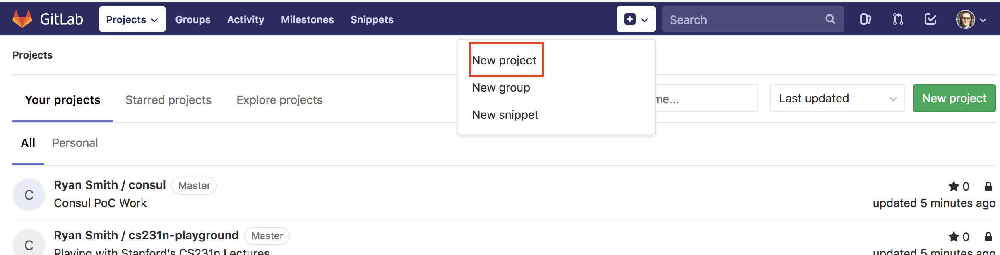
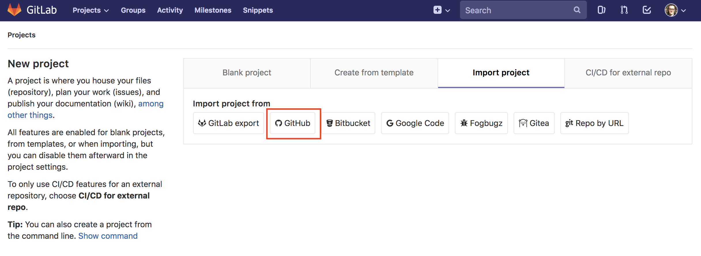
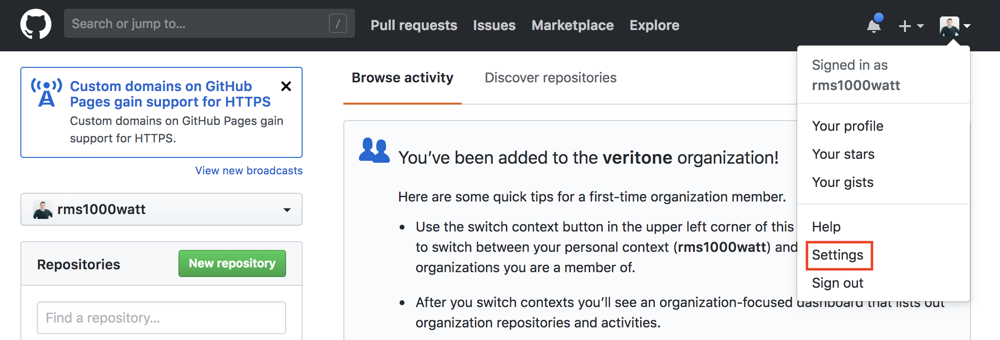
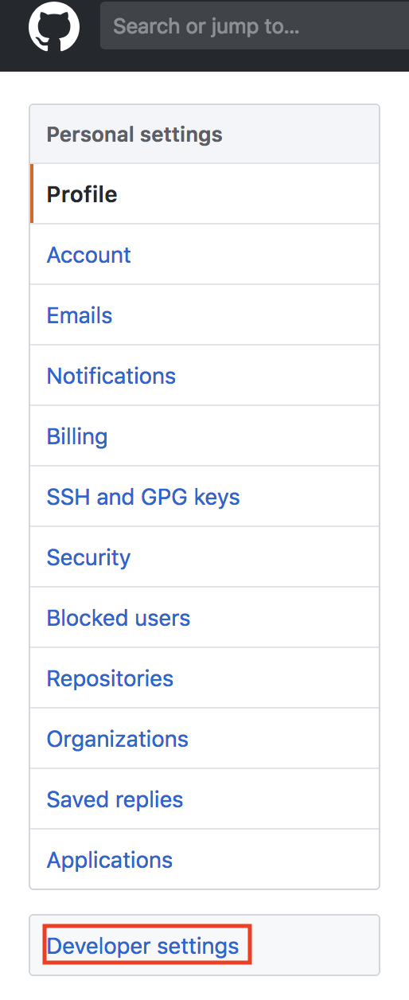
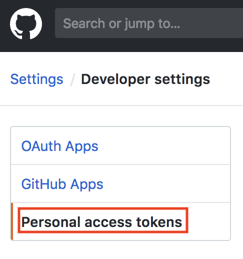
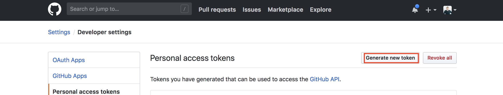
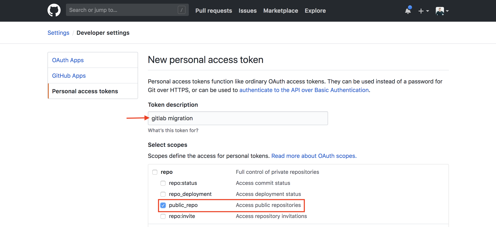
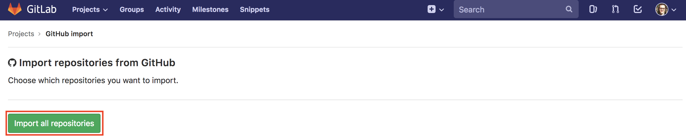

# Migrate from Github to Gitlab

## Introduction

After the recent acquisition of Github by Microsoft, there's a big interest to migrate all Github repos to Gitlab.

## Contents

- [Migrating Projects into Gitlab](#migrating-projects-into-gitlab)
- [Updating Your Local Projects](#updating-your-local-projects)


## Migrating Projects into Gitlab

Here are the steps to batch migrate your Github projects into Gitlab

- Create a new Gitlab Project



- Select import project



- Gitlab is going to ask for you to sign in or provide a Github Access Token. Add a token
- Go to Github settings



- Select developer settings



- Select personal access token



- Select generate new token



- Name the repo and give it access to public repos



- Put that token in at Gitlab
- Import all repos



- Give gitlab some time to import all repos


## Updating Your Local Projects

Now that all repos have been imported into Gitlab, you need to change your `git remote` to gitlab's URL.

(These commands might need to be tailored to your specific needs, but ought to work for most people)

```bash
# Update this value to your local git directory & remote name
export GIT_DIR=$GOPATH/src/github.com/rms1000watt
export REMOTE_NAME=origin

for CHILD_DIR in $(ls -d $GIT_DIR/*/); do
  if [ ! -d "$CHILD_DIR.git" ]; then
    continue
  fi

  cd $CHILD_DIR

  newURL=$(git remote -v | grep $REMOTE_NAME | head -1 | xargs | cut -d ' ' -f 2 | sed 's/github.com/gitlab.com/g')
  if [ "$newURL" = "" ]; then
    echo "Remote '$REMOTE_NAME' not found in dir '$CHILD_DIR'"
    continue
  fi

  git remote rm $REMOTE_NAME
  git remote add $REMOTE_NAME $newURL
  git push $REMOTE_NAME
done

unset GIT_DIR
unset REMOTE_NAME
```
